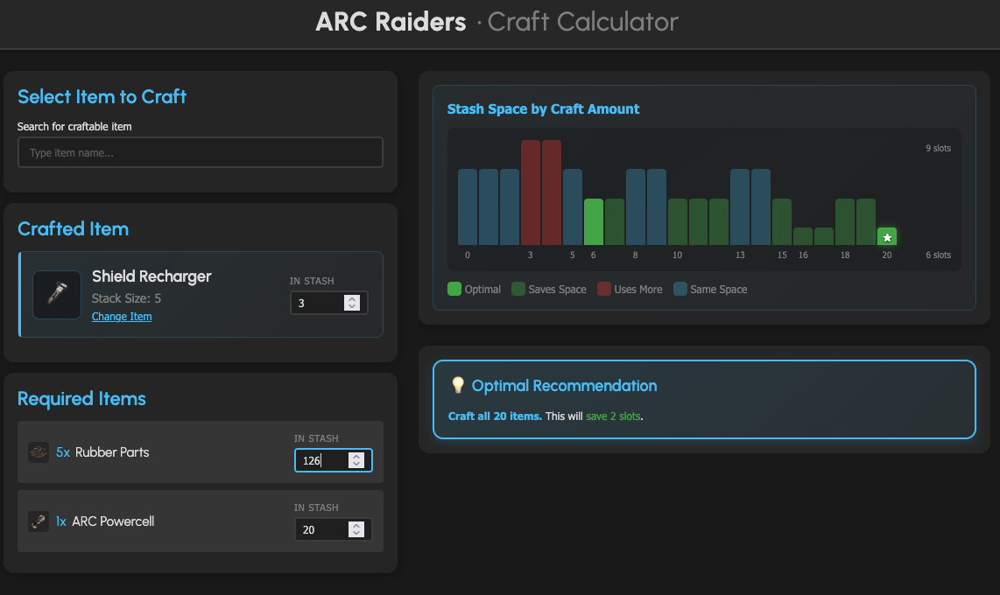

# ARC Raiders - Crafting Stash Optimizer

A specialized calculator for the game [**ARC Raiders**](https://arcraiders.com/) to help players optimize users stash space when crafting. It calculates whether crafting a specific item will result in a net gain or loss of stash slots, taking into account stack sizes, current inventory, and recipe requirements.



## 🚀 Features

- **Stash Space Impact Analysis**: Instantly see if crafting an item will free up or consume more stash space.
- **Optimal Craft Amount**: Automatically calculates the exact number of items to craft to maximize stash space efficiency.
- **Visual Stash Graph**: View a breakdown of stash usage for every possible craft amount.
- **Multi-Material Support**: Handles complex recipes with multiple required items and varying stack sizes.
- **Incomplete Stack Integration**: Account for items you already have in your stash, including partially filled stacks.
- **Real-time Calculations**: Visual feedback and results update immediately as you adjust quantities.
- **Game-Accurate Data**: Uses stack sizes and item data from [arctracker.io](https://arctracker.io).

## 📖 How to Use

1.  **Define the Target Item**:
    - Select or enter the item you want to craft.
    - Enter the number of these items you **already possess** (Incomplete Stack).
2.  **Required Materials**:
    - Specify your **Current Amount** for that material.
3.  **Analyze the Results**:
    - **Maximum Craftable**: Shows how many items you can make with your current materials.
    - **Stash Delta**: Displays the change in stash slots (e.g., "+2 slots freed").
    - **The Recommendation**: Follow the "Optimal Recommendation" to reach the most space-efficient stash state.

## 🛠️ Development

### Prerequisites

- Node.js (v18 or higher recommended)
- npm

### Installation

```bash
git clone https://github.com/baschny/arcraiders-craft-calc.git
cd arcraiders-craft-calc
npm install
```

### Updating Game Data

The application relies on item data that can be synced from the [RaidTheory/arcraiders-data](https://github.com/RaidTheory/arcraiders-data) repository.

1.  Ensure you have the `arcraiders-data` repository cloned in the same parent directory as this project.
2.  Run the update script:
    ```bash
    ./update-data.sh
    ```
    This will sync JSON definitions and regenerate the items database in `public/data/items.json`.

### Available Scripts

- `npm run dev`: Starts the Vite development server.
- `npm run build`: Compiles TypeScript and builds the production-ready app.
- `npm run lint`: Runs ESLint to check for code quality issues.
- `npm run preview`: Locally previews the production build.

## 💻 Tech Stack

- **Framework**: [React 19](https://reactjs.org/)
- **Language**: [TypeScript](https://www.typescriptlang.org/)
- **Bundler**: [Vite](https://vitejs.dev/)
- **Styling**: [SCSS (Sass)](https://sass-lang.com/) with a modular structure.
- **State Management**: React Hooks.

## 🤝 Contributing

Contributions are welcome! If you have suggestions for new features or find any bugs, please open an issue or submit a pull request.

## 📄 License

Distributed under the MIT License. See `LICENSE` for more information.

## 🙏 Acknowledgments

- Item data and item assets provided by [RaidTheory/arcraiders-data](https://github.com/RaidTheory/arcraiders-data) and [arctracker.io](https://arctracker.io) . Thank you for making this data available!
- Inspiration from the ARC Raiders community

---
*Note: This is a fan-made tool and is not officially affiliated with Embark Studios or ARC Raiders.*
